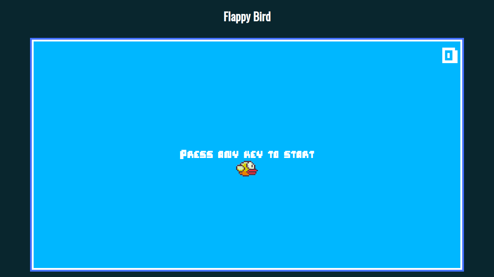
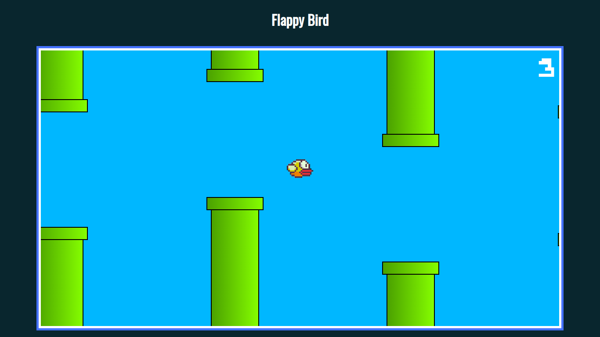
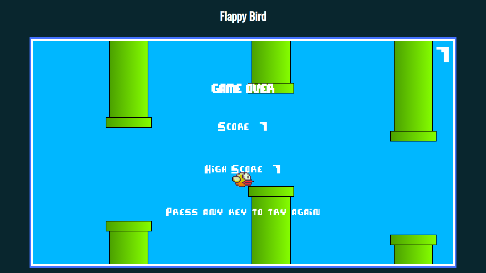
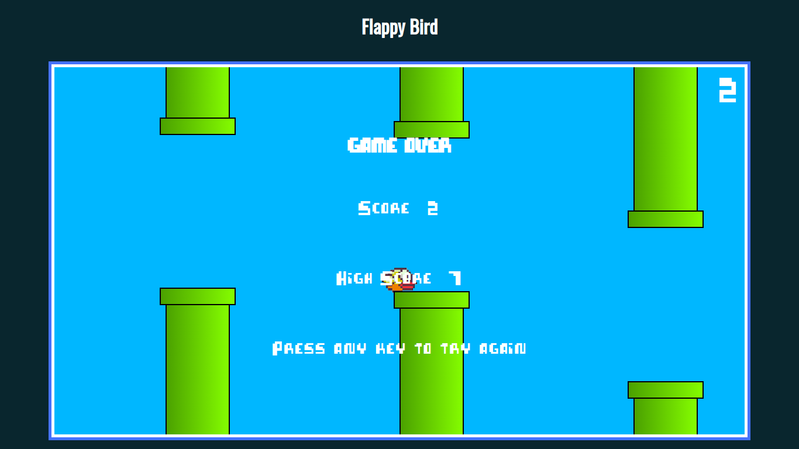

# Flappy Bird Training
Project that mimics the flappy bird game, using only HTML, CSS and JS

- Created following an udemy course
- I made my own modifications
- Canvas libraries were not used

## Screenshots

## How to build project
There is no need to build the project, just download .zip or clone the repository, then open the index.html file in your browser.